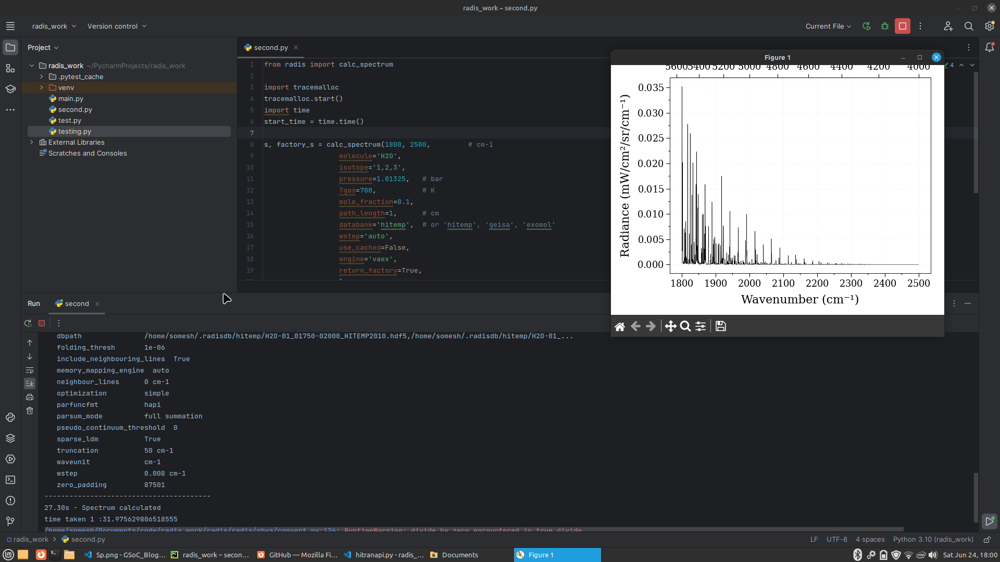

After the community bonding period , I continued refactoring the code for vaex . 
I have the following the things in this period 

- Test cases for fetch_databank() and load_databank() functions
- Replaced the portion of code which is different for Vaex as compared with Pandas

### Test Cases for loading dataframe in Vaex dataframe format

Test Cases are written to test the following :

- Number of columns are same in both Vaex dataframe and Pandas dataframe
- Number of lines in same in both the dataframe
- Compared the value of some of the column with corresponding the column value
- Calculated the spectrum of CO molecule under equilibrium and compared both the spectrum are the same 


One of the test case added is following , I have simply fetched dataframe in Vaex dataframe format and pandas , then compared the if the above conditions are satisfied are not .
```
def test_df_from_vaex_and_pandas():
    from radis.lbl import SpectrumFactory

    sf = SpectrumFactory(
        2284,
        2300,
        wstep=0.001,  # cm-1
        pressure=20 * 1e-3,  # bar
        cutoff=0,
        path_length=0.1,
        mole_fraction=400e-6,
        molecule="CO",
        isotope="1,2",
        medium="vacuum",
        truncation=5,
        verbose=0,
    )
    sf.engine = 'vaex'
    sf.warnings["MissingSelfBroadeningWarning"] = "ignore"
    # Testing Hitran
    sf.fetch_databank("hitran", memory_mapping_engine='vaex', output='pandas', load_columns="all")
    df_pandas = sf.df0

    sf.fetch_databank("hitran", memory_mapping_engine='vaex', output='vaex', load_columns="all")
    df_vaex = sf.df0

    assert df_vaex[0][0] == df_pandas.iloc[0]["wav"]

    columns_vaex = df_vaex.column_names
    columns_pandas = df_pandas.column
    comparison = (df_vaex.column_names == df_pandas.columns)

    assert comparison.all()

    # Testing Hitemp
    sf.fetch_databank("hitemp", memory_mapping_engine='vaex', output='pandas', load_columns="all")
    df_pandas = sf.df0

    sf.fetch_databank("hitemp", memory_mapping_engine='vaex', output='vaex', load_columns="all")
    df_vaex = sf.df0

    assert df_vaex[0][0] == df_pandas.iloc[0]["wav"]

    columns_vaex = df_vaex.column_names
    columns_pandas = df_pandas.column
    comparison = (df_vaex.column_names == df_pandas.columns)
```

### Refactoring the code to calculate the Spectrum using Vaex dataframe 

To calculate the spectrum using the Vaex dataframe ,I had to made changes to the following 

- radis/api/hitranapi.py
- radis/api/cdsdapi.py
- radis/api/hdf5.py
- radis/api/cache_files.py
- radis/api/tools.py
- radis/io/exomol.py
- radis/io/geisa.py
- radis/io/hitran.py
- radis/io/query.py
- radis/lbl/base.py
- radis/lbl/broadening.py
- radis/lbl/calc.py
- radis/lbl/loader.py

These are all files which are involved in calculating the Spectrum of molecule(s) ,from loading to calculating . I have only refactord the part that is required to Equilibrium Calculations .I kept the previous implementation of Pandas and just added code for Vaex .


For loading the main changes are done in hitranapi.py for parsing the molecules and i also had to spend a lot time on it to find the equivalent operations functions in Vaex as in Pandas .
Finally , i was able to resolve the issue and below is final code that worked for me .

```
def _parse_HITRAN_class1(df, verbose=True,dataframe_type="pandas"):
    r"""Diatomic molecules: CO, HF, HCl, HBr, HI, N2, NO+


    Parameters
    ----------
    df: pandas Dataframe
        lines read from a HITRAN-like database


    Notes
    -----
    HITRAN syntax [1]_ :

    >>>       v
    >>>  13x I2

    References
    ----------

    .. [1] `Table 3 of Rothman et al. HITRAN 2004 <https://www.cfa.harvard.edu/hitran/Download/HITRAN04paper.pdf>`__


    """

    if dataframe_type == "vaex":
        # 1. Parse

        extracted_values = df['globu'].str.extract_regex(pattern = r"[ ]{13}(?P<vu>[\d ]{2})")
        df['vu'] = extracted_values.apply(lambda x : x.get('globu'))
        df['vu'] = df.evaluate(df['vu'])

        extracted_values = df['globl'].str.extract_regex(pattern = r"[ ]{13}(?P<vl>[\d ]{2})")
        df['vl'] = extracted_values.get(df['globl'])
        df['vl'] = df.evauate(df['vl'])

        # 2. Convert to numeric
        cast_to_int64_with_missing_values(df, ["vu" ,"vl"], dataframe_type=dataframe_type)

        # 3. Clean
        del df["globu"]
        del df["globl"]

        return df
    elif dataframe_type == "pandas":
        # 1. Parse
        dgu = df["globu"].astype(str).str.extract(r"[ ]{13}(?P<vu>[\d ]{2})", expand=True)
        dgl = df["globl"].astype(str).str.extract(r"[ ]{13}(?P<vl>[\d ]{2})", expand=True)

        # 2. Convert to numeric
        cast_to_int64_with_missing_values(dgu, ["vu"],dataframe_type=dataframe_type)
        cast_to_int64_with_missing_values(dgl, ["vl"],dataframe_type=dataframe_type)

        # 3. Clean
        del df["globu"]
        del df["globl"]

        return pd.concat([df, dgu, dgl], axis=1)
    else:
        raise NotImplementedError(dataframe_type)

```


For other part of the code , i added an additional parameter self.dataframe_type and whenever operations are different for vaex and pandas ,I used it to execute the part of code for the respective dataframe type as whether it is Vaex or Pandas . 

#####Spectrum using Vaex and Pandas 

- Code used 

```
from radis import calc_spectrum

s, factory_s = calc_spectrum(1800, 2500,         # cm-1
                  molecule='H2O',
                  isotope='1,2,3',
                  pressure=1.01325,   # bar
                  Tgas=700,           # K
                  mole_fraction=0.1,
                  path_length=1,      # cm
                  databank='hitemp',  # or 'hitemp', 'geisa', 'exomol'
                  wstep='auto',
                  use_cached=False,
                  engine='vaex',
                  return_factory=True,
                  )

s.apply_slit(0.5, 'nm')       # simulate an experimental slit
s.plot('radiance')
```

##### Using Vaex



##### Using Pandas
As i also kept the Pandas implementation , spectrum calculated using that is 

