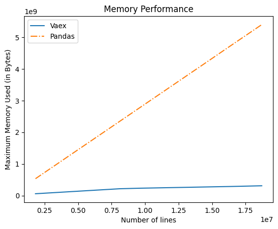

After completing all the changes to compute Spectrum using Vaex , I compared the memory used during the execution of the program . I used tracemalloc to compute memory uses to compute Spectrum .

### Computing the spectrum
Following code is used , and memory maximum memory used during the execution of this code is recorded for Vaex and Pandas

```

from radis import calc_spectrum
import tracemalloc
tracemalloc.start()

s, factory_s = calc_spectrum(1800, 2500,         # cm-1
                  molecule='H2O',
                  isotope='1,2,3',
                  pressure=1.01325,   # bar
                  Tgas=700,           # K
                  mole_fraction=0.1,
                  path_length=1,      # cm
                  databank='hitemp',  # or 'hitemp', 'geisa', 'exomol'
                  wstep='auto',
                  use_cached=False,
                  engine='pandas',
                  return_factory=True,
                  )

s.apply_slit(0.5, 'nm')       # simulate an experimental slit
s.plot('radiance')

print(tracemalloc.get_traced_memory())
tracemalloc.stop()

```


### Results
  
It can be seen from the graph below that Vaex takes very less memory space in comparison to Pandas.

