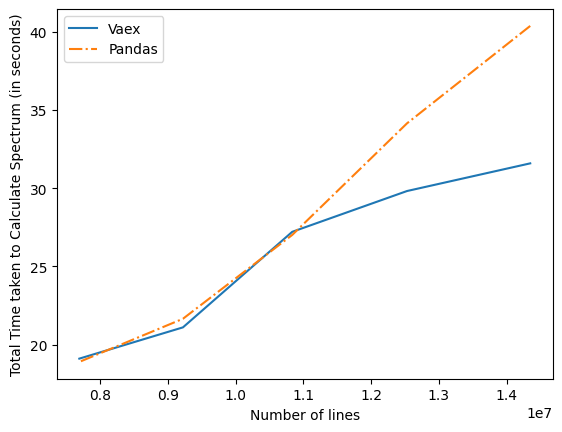
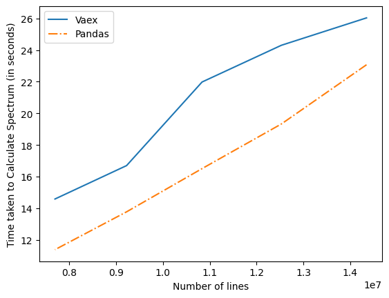
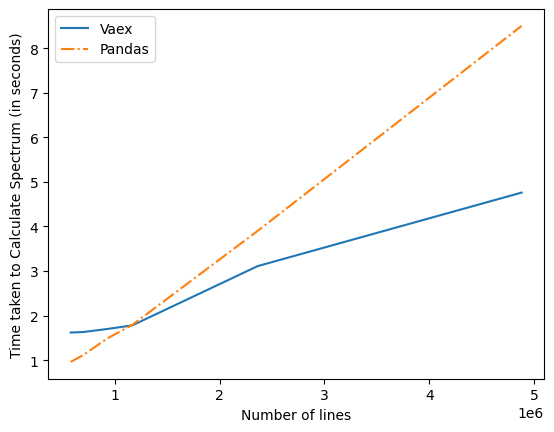
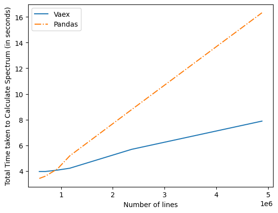

Though Vaex reduced memory use by RADIS to compute specturm but it is slow for smaller databank and in our case when the number of lines in the databank is very less . The slow performance of Vaex for smaller dataframes is due to three main reasons for our implementation of RADIS
- First vaex is optimized for larger databank and doesn't focus that much for smaller dataframe .
- Vaex uses virtual columns to reduce memory and only compute the virutal column when it is required it saves memory space but in case when virtual column 
is required multiple times then it is computed multiple times and it costs time . For Pandas it only compute the column only once and saves it for further calculations and in-memory compute of Pandas are faster than Vaex for smaller dataframes.
- Vaex is based on Apache Arrow and uses Expression class for column while for Pandas which stores column as numpy no conversion is required to use library functions of numpy but for vaex some operations require explict conversion to numpy array and it costs time.


Apart from this there was issue it the implementation of vaex which are now optimized by better alternatives.
Intially the time graph for Vaex and Pandas in terms of time comparison was as given below-

Total Time  which is the sum of loading time and computation time for calculating spectrum . 
Plot of Total Time vs Number of lines Graph



Computation time , it is time required to compute the spectrum using Vaex or Implementation 
Plot of Compuation Time vs Number of lines Graph




##Optimizations 

- Calculating Sum 
 
 At first we were computing the sum as 

 ```
 error = df[b].S.sum() / df.S.sum() * 100
 ```
but later changed it to 
```
error_cutoff = df[b].sum(df[b].S) / df.sum(df.S) * 100
```

The time taken to calculate 25 spectra decreased from 6.0 s to 5.4 s

Code used was

```
from radis import calc_spectrum
import time

t0 = time.time()
for i in range(25):
    s = calc_spectrum(2000, 2010,         # cm-1
                      molecule='CO',
                      isotope='1,2,3',
                      pressure=1.01325,   # bar
                      Tgas=1000,
                      mole_fraction=0.1,
                      databank='hitemp',  # or 'hitemp'
                      diluent = "air",     
                      verbose = 0,
                      engine = "vaex"
                      )
t1 = time.time()
print(t1 -t0)
```


- Not using df.extract()
After masking some of the rows, that is filtering some of the rows based on some conditions . Then I was using df.extract(), later i found it was using a lot of time .So i commented that and refactored code to work without it .
```
df = df.extract() # later commented it .
```

Improvements after this was quite impressive as i found out running below codes

It reduced calculation time for the code below by 10 seconds

```
from radis import calc_spectrum

import time
t0=time.time()

s = calc_spectrum(1500, 2500,         # cm-1
                      molecule='H2O',
                      isotope='1,2,3',
                      pressure=1.01325,   # bar
                      Tgas=700,           # K
                      mole_fraction=0.1,
                      wstep='auto',
                      path_length=1,      # cm
                      databank='hitemp',  # or 'hitemp', 'geisa', 'exomol'
                      engine='vaex',
                      )

s.apply_slit(0.5, 'nm')       # simulate an experimental slit

t1=time.time()

print('Time taken : '+str(t1 - t0))

```

And reduced 0.5 seconds calculation time for the code

```
from radis import calc_spectrum
import time
t0=time.time()
s = calc_spectrum(2000, 2010,         # cm-1
                  molecule='CO',
                  isotope='1,2,3',
                  pressure=1.01325,   # bar
                  Tgas=1000,
                  mole_fraction=0.1,
                  databank='hitran',  # or 'hitemp'
                  diluent = "air",
                  verbose = 3,
                  engine = "vaex"
                  )
t1=time.time()


print('Time taken : '+str(t1-t0))
```

After all of this updated time graph were as below 




I significant improvement can be observed from it .


Now to smaller time performance of smaller dataframe , I converted the vaex dataframes to pandas for smaller databases. And overall improvemets are as 
- Memory performance is improved for all dataframes.
- Time performance is same for smaller dataframes , and for larger dataframes time performance of vaex is quite better than Pandas.