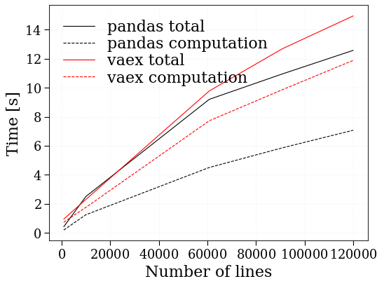

I have finished the refactoring the code for vaex and also writtten test cases to compare the spectrum calculated using pandas with the dataframe calculated using vaex dataframe . Also, Various spectroscopic quantities as absorbance , emissitivity is also compared for the both the dataframams.
Also, there was many issues that was raised by the maintainers and I have resolved almost all of these , and commented on the other issues to discuss the problem and discuss some possible solution .Issues raised by the maintainers was mainly related to make changes more matainable and easy to understand and simple programming logic is preferred inplace of using some complex code without explaining that in detail.
Also , the issue was to ensure a light test suite , that is test cases which takes less resources and time . Initialy , I didn't focused on this thing and focused on testing the code and changes more elaborately by writing the test cases that cover many areas of code .

But, later as told by maintainer I have refacatored the changes and made the changes more light and test cases more light .It helped to reduce the time required test the new commit as excecution time of the test cases were reduced.
After, all this another thing was to add benchmark test to compare the memory use by vaex and pandas and also compare the execution time used by both these engines.

Benchmark Test added to compare time taken by code is :
```
def compare_vaex_pandas_time():
    """
    Compares the time performance of pandas and Vaex and generates a plot. This scripts takes several minutes to run.
    This results shoud shown that vaex and pandas provide similar performances in term if speed.
    Returns
    -------
    None.
    """
    time_list, timeC_list, lines_list = [], [], []
    time_list_va, timeC_list_va, lines_list_va = [], [], []
    wmin = 1000
    steps = 5
    wmax_arr = np.geomspace(10, 1000, steps)

    initial_engine = config[
        "DATAFRAME_ENGINE"
    ]  # To make sure dataframe engine not changed after running this test
    pb = ProgressBar(N=2 * steps)
    for i, engine in enumerate(["vaex", "pandas"]):
        config["DATAFRAME_ENGINE"] = engine
        for j, w_range in enumerate(wmax_arr):
            t0 = time.time()
            s = calc_spectrum(
                wmin,
                wmin + w_range,  # cm-1
                molecule="H2O",
                isotope="1,2,3",
                pressure=1.01325,  # bar
                Tgas=1000,
                mole_fraction=0.1,
                databank="hitemp",  # or 'hitemp'
                wstep="auto",
                cutoff=1e-28,
                verbose=0,
            )
            t1 = time.time()
            if engine == "vaex":
                timeC_list_va.append(s.conditions["calculation_time"])
                lines_list_va.append(s.conditions["lines_calculated"])
                time_list_va.append(t1 - t0)
                # lines_list_va.append(s.conditions['lines_calculated']+s.conditions['lines_cutoff'])
            else:
                timeC_list.append(s.conditions["calculation_time"])
                lines_list.append(s.conditions["lines_calculated"])
                time_list.append(t1 - t0)
                # lines_list.append(s.conditions['lines_calculated']+s.conditions['lines_cutoff'])
            pb.update(i * steps + (j + 1))
    plt.figure()
    plt.plot(lines_list, time_list, "k", label="pandas total")
    plt.plot(lines_list, timeC_list, "k--", label="pandas computation")
    plt.plot(lines_list_va, time_list_va, "r", label="vaex total")
    plt.plot(lines_list_va, timeC_list_va, "r--", label="vaex computation")
    plt.ylabel("Time [s]")
    plt.xlabel("Number of lines")
    plt.legend()

    config["DATAFRAME_ENGINE"] = initial_engine
```


while Graph for Memory use and code are :


```
# Compare the memory performance of Pandas and Vaex
def compare_pandas_vs_vaex_memory():
    """
    Compare memory usage of `engine="vaex"` and `engine="pandas"` in calc_spectrum.
    Expected behavior is "vaex" using much less memory. This function takes tens of seconds to run.
    Returns
    -------
    None.
    """

    import tracemalloc

    initial_engine = config[
        "DATAFRAME_ENGINE"
    ]  # To make sure dataframe engine not changed after running this test
    for engine in ["pandas", "vaex"]:
        config["DATAFRAME_ENGINE"] = engine
        tracemalloc.start()
        s = calc_spectrum(
            1000,
            1500,  # cm-1
            molecule="H2O",
            isotope="1,2,3",
            pressure=1.01325,  # bar
            Tgas=1000,  # K
            mole_fraction=0.1,
            wstep="auto",
            databank="hitemp",  # or 'hitemp', 'geisa', 'exomol'
            verbose=0,
        )
        snapshot = tracemalloc.take_snapshot()
        memory = tracemalloc.get_traced_memory()
        tracemalloc.stop()

        # Some raw outputs
        print("\n******** Engine = {} ***********".format(engine))
        print(
            "Peak, current = {:.1e}, {:.1e} for {:} lines calculated".format(
                *memory, s.conditions["lines_calculated"]
            )
        )

        # More sophisticated
        print("*** List of biggest objects ***")
        top_stats = snapshot.statistics("lineno")
        for rank, stat in enumerate(top_stats[:3]):
            print("#{}".format(rank + 1))
            print(stat)

        # Clear for next engine in the loop
        tracemalloc.clear_traces()

    config["DATAFRAME_ENGINE"] = initial_engine

```